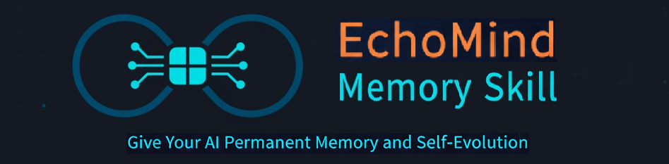

<p align="center">
  
</p>

[](https://github.com/OpenClaw)
[](https://github.com/Hermes-Agent)
[](https://claude.ai/code)
[](https://github.com/open-code-ai)


# EchoMind Memory Skill —— 让你的 AI 拥有永久记忆与自我进化能力


🌐 **English Version:** [README.md](README.md)


> 支持 Hermes Agent、OpenClaw、OpenCode、Claude Code 生态的长期记忆 Skill。

> 让你的 AI 不再"失忆"——记得你的偏好、风格、研究方法，自我反思自我进化。

> EchoMind-Memory Skill帮助你：在对话中提取知识，在反思中沉淀规则。


📦 **项目地址:** https://github.com/jasonatgit/echomind_memory.skill


---


## EchoMind 核心能力

### 基础架构
| 功能 | 说明 |
|------|------|
| **七类记忆系统** | User / Task / Experience / Context / Knowledge / Research / Reflection |
| **零依赖本地存储** | SQLite 单文件数据库，无需 Docker / PostgreSQL / Redis |
| **结构化迁移 + 事务写入** | 结构化迁移列表 + 事务回滚；store() 一次性包裹 5 次保存 |

### 记忆智能（反思推理）
| 功能 | 说明 |
|------|------|
| **自我进化引擎 Agent** | 自动从原始记忆中提炼语义知识和程序化规则，零配置 LLM 注入；低置信度反思自动丢弃防止幻觉污染 |
| **Ebbinghaus遗忘曲线** | 覆盖全部 6 种记忆类型，自动降权或排除冷数据 |
| **记忆生命周期状态机** | Active → Stale → Archived → Superseded 全状态追踪，基于新鲜度自动转换 |
| **知识演化追踪** | 取代/丰富/确认/挑战四种关系 — Jaccard + LLM 混合检测 |
| **Flags 标记系统** | 自动检测 needs_verification 和 contradiction 的知识条目 |
| **记忆健康报告** | 按类型+状态聚合统计 + 7天增长 + Flags 摘要 |
| **实体抽取** | LLM 优先 + 关键词兜底（技术/概念实体） |
| **经验沉淀与复用** | 上次修复的问题 / 用过的算法模型 → 下次自动推荐 |

### 检索与优化（RL强化自学习）
| 功能 | 说明 |
|------|------|
| **RL强化学习自动优化** | 根据用户正/负反馈自动调整权重并持久化；余弦学习率衰减 + epsilon-greedy 探索 |
| **多重检索触发** | 关键词 + RL 权重 + LLM 语义 — 真正的"语义记忆系统" |
| **自适应反思批处理** | 基于周活跃度动态调整反思触发阈值 |
| **Few-Shot 锚定** | 小样本快速构建记忆规范，提升记忆质量 |

### 用户理解
| 功能 | 说明 |
|------|------|
| **6 类偏好推理** | code_style / response_style / platform / language / depth / tone |
| **用户纠正信号检测** | 中英文关键词匹配纠正信号，触发即时反思 |
| **会话隔离上下文管理** | 每 session_id 独立上下文窗口，LRU 淘汰 + 消息归档 |

### 平台与集成
| 功能 | 说明 |
|------|------|
| **跨框架兼容** | 独立于 LLM，适配 Hermes / OpenClaw / OpenCode / Claude Code |
| **平台感知记忆隔离** | 同平台 ×1.0，跨平台 ×0.5；按用户/项目/会话/主题/领域隔离 |
| **双传输 MCP 网关** | stdio + Streamable HTTP；7 个原生 Claude Code 工具 |
| **记忆 CRUD API** | DELETE 单条/全用户 + TTL 自动清理 |
| **Hermes Agent 深度集成** | MemoryProvider 各版本兼容，每轮自动存取，零 LLM 决策 |

---

### 自动检索触发
EchoMind 记忆系统专门针对*科研方向*的记忆进行了优化，对查询的研究论文、理论模型、研究方法等进行存储。

当查询涉及以下领域*关键词*或相关*语义*时，系统自动检索研究记忆：

| 领域  |
|------|
| 管理科学 |
| AI  |
| NLP  |
| 生物学  |
| 计算机  |
| 机器人  |
| 语音与音频  |
| 推荐系统  |
| 统计与决策  |

**其他学科与关键词均可定制优化**


---

## 支持框架

| 框架 | 支持方式 | 可靠性 |
|------|----------|--------|
| **Hermes-Agent** | MemoryProvider 插件 (自动, v0.13.0–v0.17.0) | ★★★★★ 100% |
| **OpenClaw** | `skill.yaml` + HTTP API 工具调用 | ★★★★☆ LLM 决策 |
| **OpenCode** | CLI + HTTP API 或 MCP stdio | ★★★★☆ LLM 决策 |
| **Claude Code** | MCP stdio 或 HTTP API | ★★★★☆ LLM 决策 |


---


## v1.2.2  新增功能

**核心要点：**
*记忆生命周期管理、知识演化追踪、实体抽取、Streamable HTTP MCP。*

| 功能 | 说明 |
|------|------|
| **记忆状态机** | Active → Stale → Archived → Superseded 生命周期追踪，基于 Ebbinghaus 新鲜度自动状态转换 |
| **知识演化追踪** | Jaccard + LLM 混合检测（取代/丰富/确认/挑战四种关系） |
| **记忆健康报告** | 输出中增加记忆健康提示节 |
| **Flags 标记系统** | 自动检测 needs_verification 和 contradiction 的知识条目 |
| **实体抽取** | LLM 优先 + 关键词兜底（技术/概念实体） |
| **Streamable HTTP MCP** | `POST /mcp` + `GET /mcp` — EchoMind MCP 支持通过 JSON-RPC over HTTP 远程访问 |
| **共享 MCP 工具层** | stdio 和 HTTP 双传输共享单一工具定义 |


---
## v1.2.0  新增功能

**核心要点：**
*MCP stdio 网关、艾宾浩斯遗忘曲线、会话隔离上下文管理、记忆 CRUD。*

| 功能 | 说明 |
|------|------|
| **MCP stdio 网关** | 7 个原生 Claude Code 工具（retrieve/store/search/feedback/reflect/delete/health），通过 stdio JSON-RPC 协议 |
| **Ebbinghaus遗忘曲线** | 基于新鲜度的记忆评分 ，覆盖全部6种记忆类型，自动排除冷数据 |
| **记忆删除 API** | 支持单条删除、用户数据全清、TTL 过期清理的 REST 端点 |
| **会话隔离上下文管理** | 每个 session_id 独立上下文窗口，LRU 淘汰 |
| **会话消息归档** | 淘汰的会话消息自动保存到数据表 |
| **用户纠正信号检测** | 中英文关键词匹配纠正信号，触发即时反思 |
| **6 类偏好推理** | code_style, response_style, platform, language, depth, tone — 关键词驱动，配置化 |
| **自适应反思批处理** | 基于周活跃度动态调整 |
| **RL 余弦衰减 + Epsilon-Greedy** | 余弦学习率衰减防止后期震荡；epsilon-greedy 探索跳出局部最优 |
| **SQLite Schema 迁移系统** | 结构化迁移列表，支持事务回滚 |
| **原子化批量写入** | 将 5 次保存操作包裹在单个事务中 |
| **Hermes Agent v0.17.0 适配** | 完整实现 `get_config_schema()`、`backup_paths()`、`save_config()` 等新接口 |


---
## v1.1.0  新增功能

**核心要点：**
*引入**专用反思引擎 Agent**，从原始情景记忆(Episodic)中主动提炼语义记忆(Semantic)和程序性记忆(Procedural) 。类似人类"睡前反思"或 Reflexion/SRMA 架构。*

| 功能 | 说明 |
|------|------|
| **自我进化引擎 Agent** 🧠 | 从原始对话中自动提炼长期知识。自动触发**自我反思**，将原始交互记录蒸馏为持久化知识、用户偏好和程序化规则——实现记忆的真正自我进化 |
| **升级强化学习能力** | RL 权重Range模式，随机采样，用户反馈自动收敛 |
| **专业 Prompt 配置化** | 对专业领域实现Prompt配置化，无需改代码即可调优 |
| **置信度过滤** | 置信度低于阈值的反思结果自动丢弃，**防止幻觉污染记忆** |
| **记忆源追踪** | 根据完整存储反思记录，平台标签、来源追踪 |
| **重要性评分** | 对记忆重要性评分，沉淀有价值记忆 |
| **多重检索触发** | 关键词 + RL 权重 + LLM 语义，真正的“语义记忆系统” |
| **记忆隔离** | 用户、项目、会话、主题、研究领域统统隔离，记忆再也不会混乱 |
| **架构升级** | 全新反思引擎架构，支持高度灵活的Prompt配置化 |


---

## v1.1.0 版本学术参考

本次发行的 v1.1.0 的技术方案中Self-Reflective Agent部分设计受到以下研究的启发：

### 1、SAGE: Self-evolving Agents with Reflective and Memory-Augmented Abilities

Liang, X., He, Y., Xia, Y., Song, X., Wang, J., Tao, M., Sun, L., Yuan, X., Su, J., Li, K., Chen, J., Yang, J., Chen, S., & Shi, T. (2024).

- **论文地址：** [arXiv:2409.00872](https://arxiv.org/abs/2409.00872)
- **发表期刊：** *Neurocomputing* (2025)


### 2、SRMA: Self-Reflective Memory Consolidation in Agentic Architectures

Satya, P. R. B. (2026).

- **论文地址：** [IJCA Vol.187 No.73](https://www.ijcaonline.org/archives/volume187/number73/self-reflective-memory-consolidation-in-agentic-architectures/)
- **发表期刊：** *International Journal of Computer Applications*, 187(73)

---

## 致谢

We sincerely thank the authors of the above papers for their pioneering work on self-reflective memory mechanisms. Their research has provided valuable theoretical foundations and inspiration for the design of EchoMind-Memory.skill 's Self-Reflective Agent.

本项目 Self-Reflective Agent 的技术方案设计受益于上述开创性研究的启发，在此向论文作者致以诚挚的学术谢意。

同时，EchoMind-Memory.skill的 `自我进化` 与上述科学研究工作主要区别在于：采用**依赖反转**（核心引擎零 LLM 耦合）、**平台感知隔离**和**零配置部署**——使其可直接用于生产环境的 Multi-Agent 系统中，无需额外基础设施。这是一个产品级的智能体应用。


---

## 历史版本说明


### v1.0.10 — Hermes v0.14.0 完整适配 (2026-05-17)

**新增 (MemoryProvider ABC 兼容):**

| 方法 | 说明 |
|------|------|
| `queue_prefetch()` | 兼容 Hermes v0.13.0+ 新增接口，消除每轮 AttributeError 日志 (was previously causing error logs on every turn) |
| `on_session_switch()` | 修复 `/resume` `/branch` `/reset` 操作后 session_id 混乱 (fixes session ID corruption after session switch operations) |
| `on_pre_compress()` | 上下文压缩前自动保存即将被丢弃的记忆 (auto-saves memories before context compression discards them) |
| `on_delegation()` | 子 agent 任务经验自动存入长期记忆 (captures sub-agent task experience into long-term memory) |


### v1.0.9 — OpenClaw / OpenCode / Claude Code 三平台兼容修复 (2026-05-16)

| 修复项 | 影响平台 |
|--------|---------|
| `main.py` 新增 `call()` 调度函数 | OpenClaw |
| `http_api.py` retrieve/store 端点透传 `platform` 参数 | 全部平台 |
| `code_format/cli.py` 修复 async→sync 崩溃 | OpenCode |
| `skill.yaml` 新增 `platform` 参数 + `openclaw.call` 声明 | OpenClaw |

### v1.0.8 — 平台感知记忆 + Hermes 适配器 (2026-05-15)

- 平台感知记忆：同平台权重 ×1.0，跨平台 ×0.5
- Hermes Agent 插件：实现 MemoryProvider 接口，每轮自动存取
- WAL 并发模式 + 自动数据迁移


## v1.0.8 已有功能

| 功能 | 说明 |
|------|------|
| **Hermes 适配插件** | 实现 Hermes Agent 记忆接口每轮自动存取。代码驱动，无需 LLM 决策，100% 可靠 |
| **平台感知记忆** | 所有上下文记忆打上平台标签（hermes/openclaw/opencode）；同平台权重 ×1.0，跨平台 ×0.5；用户偏好按平台隔离 |
| **WAL 并发模式** | 支持多进程并发读写 |
| **自动迁移** | 旧表结构自动迁移升级 |
| **用户偏好按平台隔离** | 不同用户、不同应用、不同平台独立偏好，隔离你的记忆 |


---
## 安装

### 前置条件

确认已安装以下工具：

| 工具 | 检查命令 | 安装方式 |
|------|---------|---------|
| **Python 3.10+** | `python3 --version` | [python.org](https://python.org) |
| **pip** | `pip --version` | Python 自带 |
| **git** | `git --version` | `sudo apt install git` / [git-scm.com](https://git-scm.com) |

### 方式一：快速安装（推荐，含开机自启）

安装脚本负责复制文件、生成配置、注册自启。

```bash
# 步骤 1: 克隆仓库
git clone https://github.com/jasonatgit/echomind_memory.skill.git
cd echomind_memory.skill

# 步骤 2: 安装 Python 依赖
pip install -r requirements.txt

# 步骤 3: 运行安装脚本
./install.sh
```

**Windows（PowerShell）：**

```powershell
# 步骤 1: 克隆仓库
git clone https://github.com/jasonatgit/echomind_memory.skill.git
cd echomind_memory.skill

# 步骤 2: 安装 Python 依赖
pip install -r requirements.txt

# 步骤 3: 运行安装脚本
.\install.ps1
```

> **`install.sh` / `install.ps1` 做了什么：**
> 1. 自动检测 Hermes 安装目录（优先级: `$HERMES_HOME` → 平台默认）
>    - Linux/macOS/WSL: `~/.hermes`
>    - Windows: `%LOCALAPPDATA%\hermes`
> 2. 复制到 `<hermes>/skills/echomind-memory/`（Skill 目录）
> 3. 复制到 `<hermes>/plugins/echomind/`（MemoryProvider 插件）
> 4. 创建默认配置 `~/.echomind/echomind_config.yaml`（已存在则跳过）
> 5. 注册开机自启（systemd / launchd / 注册表）

**安装完成后验证：**

```bash
curl http://localhost:8005/health
# 预期返回: {"status": "ok", "version": "1.2.2"}
```

---

### 方式二：手工安装（不含开机自启）

适合不想注册自启的用户：

```bash
# 1. 克隆仓库并安装依赖（同方式一步骤 1-2）
git clone https://github.com/jasonatgit/echomind_memory.skill.git
cd echomind_memory.skill
pip install -r requirements.txt

# 2. 创建配置
mkdir -p ~/.echomind && cp echomind_config.yaml ~/.echomind/

# 3. 手动启动服务
python main.py
# 服务运行在 http://localhost:8005
```

> **提示：** 需要开机自启请使用上方方式一。

---

### Hermes-Agent 激活自动存取（推荐）

完成上述安装后，还需额外激活 Hermes 的 MemoryProvider 插件——这一步让 Hermes 每轮对话自动存取记忆，无需 LLM 决策：

```bash
# 1. 安装插件文件（一键安装已自动完成此步，手工安装需手动执行）
#    默认 Hermes 目录为 ~/.hermes，如不相同请自行调整（检查 HERMES_HOME）
cp -r echomind_memory.skill/* ~/.hermes/plugins/echomind/

# 2. 激活 MemoryProvider
hermes config set memory.provider echomind

# 3. 重启 Hermes 即可生效
```

**效果：** 每轮对话自动存入、自动检索。对话后自动触发自我反思——无需任何额外配置。

---

### Claude Code MCP 网关 (v1.2.0+)

启动 HTTP 服务后（`python main.py`），注册为 Claude Code MCP 服务器：

```bash
# 注册 MCP 网关（替换路径为你的安装位置）
claude mcp add echomind -- python ~/.hermes/skills/echomind-memory/adapters/mcp_gateway.py
```

**可用工具：** `echomind_retrieve`、`echomind_store`、`echomind_search`、`echomind_feedback`、`echomind_reflect`、`echomind_delete`、`echomind_health`

**效果：** Claude Code 可直接通过原生 MCP 工具读写 EchoMind 记忆——无需 HTTP API 调用。

---

### OpenClaw / OpenCode / Claude Code

将 EchoMind 安装到对应框架的 skills 目录，然后启动 HTTP 服务：

```bash
# 安装依赖
pip install -r requirements.txt

# 复制到框架 skills 目录（按需选择）
cp -r . ~/.openclaw/skills/echomind-memory/    # OpenClaw
cp -r . ~/.opencode/skills/echomind-memory/    # OpenCode

# 启动服务
python main.py
```

服务运行在 `http://localhost:8005`，LLM 根据 skill 触发规则自动调用记忆工具。

### Python 快速上手

```python
from main import call

# 存储记忆（平台感知）
call("store_memory",
    user_id="alice",
    platform="hermes",
    task_id="task-001",
    context=[{"role": "user", "content": "供应链协调有哪些常见模型"}],
    task_status="completed",
    success=True,
)
# 检索记忆
result = call("retrieve_memory", user_id="alice", query="供应链协调模型")
for m in result["working_memory"]:
    print(f"[{m['source']}] {m['content'][:80]}")
# 记录反馈（AI 自我进化）
call("record_feedback",
    user_id="alice",
    task_id="task-001",
    feedback="positive",
    retrieved_memories=result["working_memory"],
)

# 触发自我反思（v1.1.0）— Hermes 适配器自动调用
# 或通过 HTTP 手动触发：POST /api/reflect
```

---

## API 端点（HTTP 模式）

| 方法 | 端点 | 说明 |
|------|------|------|
| `POST` | `/api/memory/retrieve` | 检索任务记忆 |
| `POST` | `/api/memory/store` | 存储对话上下文 |
| `POST` | `/api/memory/feedback` | 记录反馈用于 RL 优化 |
| `POST` | `/api/memory/sync-code` | 同步项目代码风格记忆 |
| `GET` | `/api/memory/search-sessions` | 搜索会话转录 |
| `GET` | `/api/memory/health` | 记忆健康报告（简报 + 状态 + flags） |
| `POST` | `/api/memory/{type}/{id}/state` | 设置记忆生命周期状态 |
| `POST` | `/api/memory/cleanup` | 基于 TTL 的记忆清理 |
| `DELETE` | `/api/memory/{type}/{id}` | 删除单条记忆 |
| `POST` | `/api/memory/delete-user` | 删除用户全部记忆 |
| `POST` | `/api/research/paper` | 添加研究论文 |
| `POST` | `/api/research/note` | 添加研究笔记 |
| `GET` | `/api/knowledge/{id}/evolution` | 查询知识演化链 |
| `GET` | `/api/config` | 读取当前配置 |
| `POST` | `/api/config/parameter` | 设置运行时配置参数 |
| `POST` | `/api/config/reload` | 从磁盘重载配置 |
| `POST` | `/api/reflect` | 自我反思 |
| `POST` | `/mcp` | MCP JSON-RPC 端点（远程） |
| `GET` | `/health` | 健康检查 |

---

## 数据存储

所有持久化数据存储在 `~/.echomind/memory.db`（SQLite 文件）。可随时备份或删除。可通过 echomind_config.yaml 中的 storage.db_path 自定义存储路径。


---

## 愿景

AI 不是工具，是协作者。协作者不应该每次见面都"重新认识你"。

EchoMind 让你的 AI：

- 记得你的编码风格、偏好和习惯
- 记得你修复过的 bug 和尝试过的方法
- 记得你研究过的论文和理论模型
- 拥有 RL 驱动的自我优化权重系统，每次交互后越用越聪明
- 这不是一个插件，这是具有*自我反思记忆*的*AI 多智能体记忆神经网络*。


## 📫 联系方式
*email：*[jasonyouatgmaildotcom](mailto:jasonyouatgmaildotcom)

---

## Q&A *点击展开*

<details>
<summary><b>Hermes Agent分身隔离及常见问题</b></summary>

### Q: 如何在 Hermes 分身（Profile）中使用 EchoMind？

EchoMind v1.1.6+ 支持 Hermes Profile 级别的记忆隔离。

**安装一次即可**：
```bash
./install.sh
```

**自动行为**：
- 默认分身 → 记忆存储在 `profile='default'`
- 其他分身（如 weixin）→ 自动创建符号链接，记忆存储在 `profile='weixin'`
- 两个分身的记忆在同一 `~/.echomind/memory.db` 中，互不干扰
- 历史数据自动归入 `default` profile

**同一分身内按项目隔离**：
```yaml
# hermes config.yaml
memory:
  provider: echomind
  project: echomind  # 可选，同一分身内按项目过滤
```

**手动为新分身建立链接**（如果创建分身在安装之后）：
```bash
ln -s ~/.hermes/plugins/echomind ~/.hermes/profiles/微信分身名/plugins/echomind
```

---

### Q: EchoMind 是否支持 Windows？

支持。v1.1.6+ 已修复跨平台路径解析，Windows 路径（如 `C:\Users\...\profiles\weixin\...`）可正确提取 profile 名称。
如果使用 WSL，路径格式与 Linux 一致。

---

### Q: 多个分身同时使用 EchoMind 会冲突吗？

不会。v1.1.6+ 采用以下机制保障并发安全：
1. **WAL 模式**：SQLite 写前日志，支持多进程并发读
2. **busy_timeout=5000**：遇到锁等待 5 秒
3. **自动重试**：极端情况下指数退避重试 3 次

---

### Q: 如何降级到旧版本？

> ⚠️ **重要**：降级时旧版 SELECT 无 `WHERE profile = ?` 过滤，所有分身数据对默认分身可见。

**安全降级步骤**：
1. 备份 `~/.echomind/memory.db`
2. 清除非 default 数据：
   ```sql
   DELETE FROM task_memory WHERE profile != 'default';
   DELETE FROM user_memory WHERE profile != 'default';
   ```
3. 再回退旧版

**推荐**：保留新版，不做降级。

---

### Q: 数据存储在哪里？如何备份？

所有数据存储在单文件 `~/.echomind/memory.db` 中。备份只需复制该文件：
```bash
cp ~/.echomind/memory.db ~/.echomind/memory.db.backup-$(date +%Y%m%d)
```

---

### Q: 迁移后数据会丢失吗？

不会。SQLite `ALTER TABLE ADD COLUMN ... DEFAULT 'default'` 是 O(1) 元数据操作，不逐行修改数据，存量 37MB 数据完整保留，自动归入 `default` profile。

---

### Q: EchoMind 是否兼容 Hermes v0.16.0？

是。EchoMind v1.1.6+ 已适配 Hermes v0.16.0 新增的 `on_session_switch(rewound=True)` 参数。
当用户执行 `/undo N` 截断对话历史时，EchoMind 自动清空上下文缓存，避免记忆污染。

### Q: EchoMind 是否兼容 Hermes v0.17.0？

是。EchoMind v1.2.0+ 完整支持 Hermes v0.17.0 的 MemoryProvider 接口，包括 `get_config_schema()`、`backup_paths()`、`save_config()` 方法。
兼容范围：Hermes v0.13.0 – v0.17.0。

</details>

<details>
<summary><b>MCP 网关设置与常见问题</b></summary>

### Q: 如何将 EchoMind 通过 MCP 连接到 Claude Code？

**本地 stdio 模式**（无需 HTTP 服务）：
```bash
claude mcp add echomind -- python ~/.hermes/skills/echomind-memory/adapters/mcp_gateway.py
```

**远程 HTTP 模式**（需要 `python main.py` 在 8005 端口运行）：
```json
{
  "mcpServers": {
    "echomind": {
      "url": "http://<你的服务器>:8005/mcp",
      "type": "streamableHttp"
    }
  }
}
```

> ⚠️ HTTP MCP 模式需要 EchoMind HTTP 服务保持运行（`python main.py`）。如果服务停止，远程 MCP 连接将不可用。stdio 模式不受影响。

### Q: MCP 有哪些可用工具？

EchoMind 提供 7 个 MCP 工具：

| 工具 | 说明 |
|------|------|
| `echomind_retrieve` | 按查询搜索长期记忆 |
| `echomind_store` | 将交互结果持久化到记忆 |
| `echomind_search` | 搜索会话转录 |
| `echomind_feedback` | 对检索结果提供反馈 |
| `echomind_reflect` | 触发最近记忆的反思 |
| `echomind_delete` | 删除特定记忆条目 |
| `echomind_health` | 检查服务健康状态 |

### Q: MCP 连接失败怎么办？

1. **stdio 模式**: 检查网关路径是否正确 — `python -c "from adapters.mcp_common import handle_mcp_request"` 应正常运行
2. **HTTP 模式**: 确认 `python main.py` 正在运行，`curl http://127.0.0.1:8005/health` 返回 `"status":"ok"`
3. **认证**: 如果 `echomind_config.yaml` 中配置了 `api_key`，需要设置 `ECHOMIND_API_KEY` 环境变量

### Q: MCP 是否支持 Claude Code 以外的工具？

是。MCP stdio 兼容任何 MCP 客户端（Claude Desktop、Cursor、Cline 等）。远程 HTTP MCP 使用 Streamable HTTP 传输协议，这是 MCP 社区标准协议。

</details>
